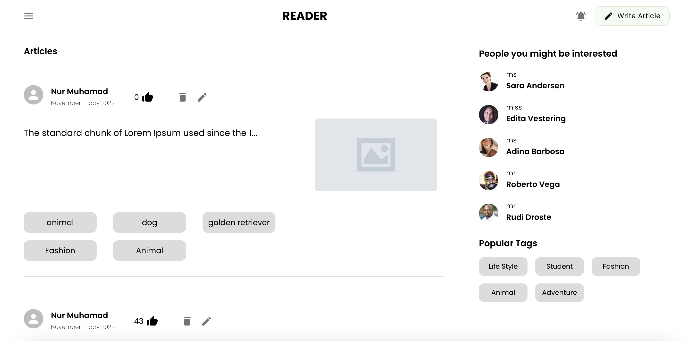
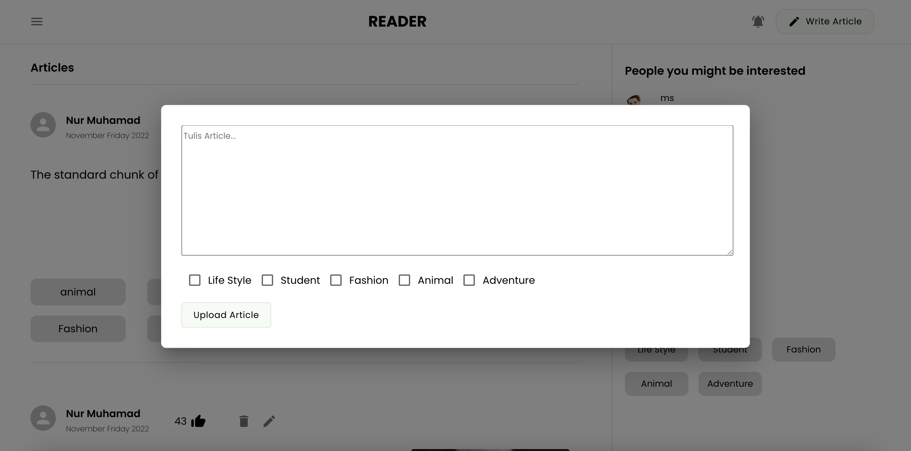
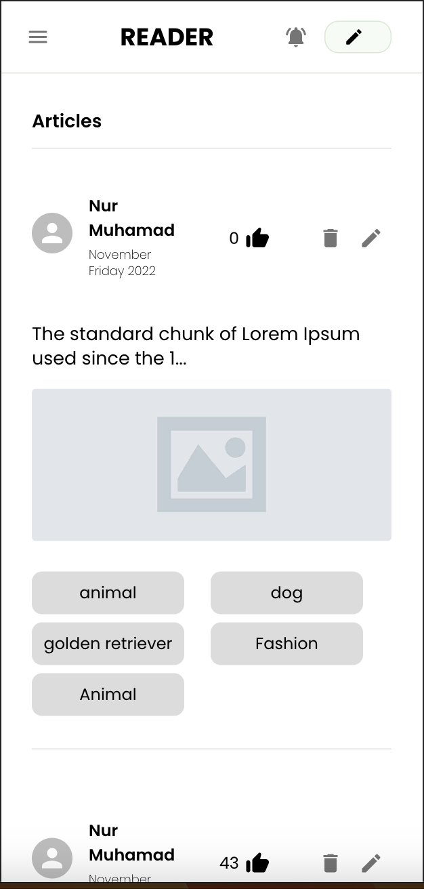

# Sinarmas Developer Test

This website application is for writing simple articles where users can create, edit and delete articles.

## Table of Contents

- [Getting Started](#getting-started)
  - [Prerequisites](#prerequisites)
  - [Installation](#installation)
  - [Setup](#setup)
- [Screenshots](#screenshots)
- [Built With](#built-with)
- [Author](#author)

## Getting Started

Before starting to install the project, there're some things that need to be done first.

### Prerequisites

Make sure all of these are properly installed in your system.

| Application  | Download                                                                            |
| ------------ | ----------------------------------------------------------------------------------- |
| Git          | [Windows](https://gitforwindows.org/) / [Linux](https://git-scm.com/download/linux) / [MacOS](https://git-scm.com/download/mac) |
| React Js | [Link](https://reactjs.org/docs/getting-started.html)                |
| Material UI | [Link](https://mui.com/material-ui/getting-started/installation/) |

### How to Installation & Running Web Application Localy

First, clone this repository into your system.

```
git clone https://github.com/nurmuhamadrum/post-article.git
```

Then, install all the packages that described in `package.json`.

```
npm install
```

After npm install proccess is done then run the Web Application.

```
npm run start
```

Wait till the web application is running in your browser on this http://localhost:3000. Now, you can explore the Web Application and its features. Enjoy!

## Screenshots





## Built With

- [REACT JS](https://reactjs.org/) - FRONTEND
- [MATERIAL UI](https://mui.com/) - LIBRARY/FRAMEWORK
- [DUMMYAPI.IO](https://dummyapi.io/) - DUMMY API

## Author

**Nur Muhamad Rum** - www.nurmuhamadrum.site
